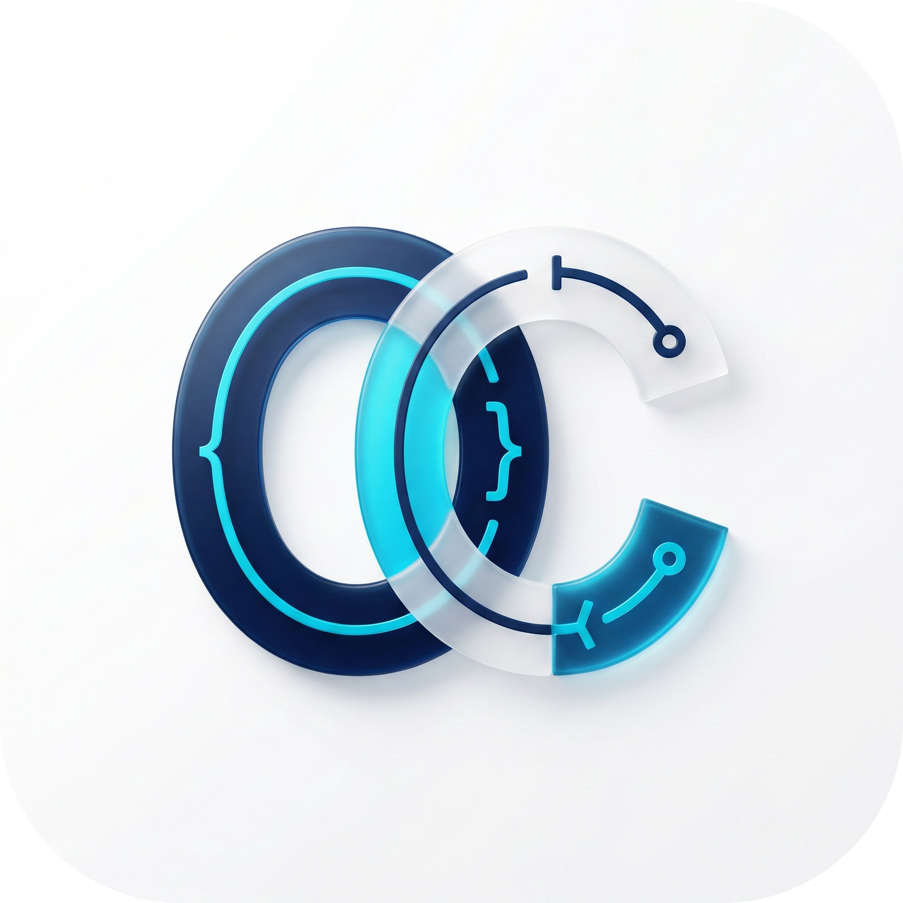

<div align="center">

# 🎛️ OC-Pad

**OpenCode 配置，从此可视化。**

一款轻量级桌面应用，让你告别手动编辑 JSON，用图形界面轻松管理 OpenCode / oh-my-opencode 的所有配置方案。

</div>


---

## 💡 项目初衷

在日常使用 [OpenCode](https://github.com/opencode-ai/opencode) 和 [oh-my-opencode](https://github.com/cs-magic/oh-my-opencode) 时，我们发现一个普遍的痛点：

> **配置管理太痛苦了。**

OpenCode 的配置依赖手动编辑 JSON 文件，字段多、层级深、容错低。当你需要在多个项目、多种模型、多套提示词之间频繁切换时，整个过程变得极其低效和容易出错。

**OC-Pad 因此而生** —— 我们希望打造一款 **专为 OpenCode 生态设计的可视化配置管理桌面工具**，让配置这件事变得简单、直观、安全。

---

## 🎯 使用场景

| 场景 | 描述 |
|------|------|
| 🔄 **多项目切换** | 不同项目使用不同的 Provider 和模型，一键激活对应配置方案 |
| 🧪 **模型调试** | 快速切换不同模型参数，对比效果，找到最佳配置组合 |
| 👥 **团队协作** | 导出标准化配置方案，团队成员一键导入，统一开发环境 |
| 🆕 **新手入门** | 无需理解 JSON 结构，通过可视化表单即可完成配置 |
| 💾 **配置备份** | 将当前生效配置保存为 Profile，随时回滚 |

---

## 🔥 解决痛点

### 痛点一：手动编辑 JSON 容易出错

配置文件字段多、嵌套深，一个逗号或引号的错误就会导致整个配置失效。


### 痛点二：多套配置切换繁琐

在终端、文件、编辑 Provider 之间手动切换，效率低下且容易遗忘。

### 痛点三：opencode 与 oh-my-opencode 配置难以同步

两套配置体系需要同时维护，字段对应关系复杂，极易产生不一致。

### 痛点四：缺乏直观的配置概览

打开 JSON 文件后，很难一眼看出"当前用了哪个模型"、"哪些参数被修改过"。

---

## ✨ 核心功能

### 📋 Profile 方案管理

创建、编辑、删除、激活多套配置方案，每套方案独立存储，互不干扰。


### 🔗 双配置联动

`opencode` 与 `oh-my-opencode` 关键字段自动同步，修改一处，两套配置同时生效。

### 🎨 可视化配置编辑

Provider、模型、核心模式参数通过表单集中编辑，支持预设模型快速选择。


### 📝 JSON 编辑器

同时提供 JSON 原始编辑能力，支持实时预览、格式化、语法校验。高级用户可随时切换至 JSON 模式精细调整。

### 🚀 启动同步

应用启动时自动从磁盘读取全局/项目层配置，确保界面状态与本地文件始终一致。

### 🌍 多语言 & 主题

- 语言：简体中文 / 繁體中文 / English
- 主题：亮色 / 暗色 / 跟随系统
- 6 种强调色可选


---

## ⚡ 优化对比

| 维度 | 手动编辑 JSON | OC-Pad |
|------|:---:|:---:|
| 配置出错率 | 🔴 高（语法/字段拼写） | 🟢 极低（表单校验 + 预设选项） |
| 多方案切换 | 🔴 手动复制/重命名文件 | 🟢 一键激活 |
| 双配置同步 | 🔴 手动维护两份文件 | 🟢 自动联动 |
| 配置概览 | 🔴 打开文件逐行阅读 | 🟢 可视化面板一目了然 |
| 上手成本 | 🔴 需理解完整 JSON 结构 | 🟢 表单引导，开箱即用 |
| 回滚能力 | 🔴 依赖手动备份 | 🟢 Profile 快照，随时回滚 |

---

## 🛠️ 技术栈

| 层级 | 技术选型 | 说明 |
|------|---------|------|
| 桌面框架 | **Tauri v2** (Rust) | 比 Electron 更轻量，内存占用低 |
| 前端 | **React 19** + TypeScript + Vite | 现代前端工程化方案 |
| 状态管理 | **Zustand** | 轻量、直观的状态管理 |
| UI | **Tailwind CSS v4** + Radix UI | 原子化样式 + 无障碍组件 |
| 本地存储 | **SQLite** (bundled) | 嵌入式数据库，零外部依赖 |
| 国际化 | **i18next** | 三语言支持 |

---

## 📦 快速开始

### 直接下载

前往 [Releases](<!-- PLACEHOLDER: GitHub Releases 页面链接 -->) 下载对应平台安装包：

| 平台 | 格式 |
|------|------|
| macOS | `.dmg` |
| Windows | `.msi` / `.exe` |
| Linux | `.deb` / `.AppImage` |

### 从源码构建

**环境要求：** Node.js 18+ · Rust stable（`rustup` 安装） · macOS 需 Xcode Command Line Tools

```bash
# 克隆仓库
git clone https://github.com/520CY/Oc-pad.git
cd Oc-pad

# 安装依赖
pnpm install

# 启动开发模式
pnpm tauri dev

# 构建安装包
pnpm tauri build
```

> 💡 没有全局 `pnpm`？使用 `npx pnpm@latest install` 代替。

---

## 🗺️ 后续规划

| 阶段 | 计划内容 | 状态 |
|------|---------|------|
| **v0.2** | 配置导入/导出（文件 & 剪贴板） | 🟡 规划中 |
| **v0.3** | 配置 Diff 对比 —— 可视化对比两套 Profile 差异 | 🟡 规划中 |
| **v0.4** | 配置模板市场 —— 社区共享最佳实践配置方案 | 💭 构想中 |
| **v0.5** | 多项目工作区 —— 同时管理多个项目的配置 | 💭 构想中 |
| **未来** | 插件机制 —— 支持自定义 Provider 适配器 | 💭 构想中 |
| **未来** | CLI 集成 —— 命令行快速切换 Profile | 💭 构想中 |

> 🙋 有想法或建议？欢迎在 [Issues](https://github.com/520CY/Oc-pad/issues) 中提出！

---

## 🤝 参与贡献

欢迎提交 Issue 和 Pull Request！

```bash
# Fork 后克隆
git clone https://github.com/<your-username>/Oc-pad.git

# 创建功能分支
git checkout -b feature/your-feature

# 提交并推送
git push origin feature/your-feature
```

---

## 📄 License

当前仓库未单独声明许可证，默认保留所有权利。若需开源发布，请补充 `LICENSE` 文件。

---

<div align="center">

**用 OC-Pad，让配置不再是负担。**

<!-- TODO: 替换为产品 Logo -->


</div>
